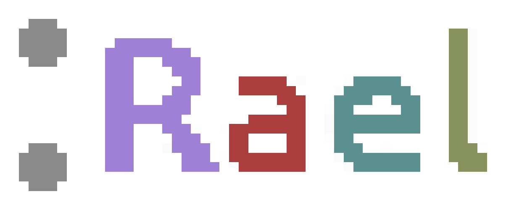

# Rael
Rael is an interpreted programming language written in C.

The language is made for people who prefer not to name their variables.

Rael was started, but not finished in [LangJam](https://github.com/langjam/jam0001).

The name Rael has no actual meaning, if you were wondering ;)

## Dependencies
* Git - to clone this repository (you can also just download it manually if you want)
* GNU Make - to build the project on unix systems
* GCC or Clang - any decent C99 compiler should work, though
* Python 2.7 or higher - for running tests (`runtests.py`)
* SDL2 - The SDL2 library is required for the :Graphics module

The default compiler is GCC, but it can be changed in the makefile's configuration
at the top to whatever you like.

Note: the language was only tested on Linux (Ubuntu 20.04, to be exact).

The language's code currently uses some Posix libraries and functions and doesn't currently support OSes without Posix support.

In the future I may or may not port Rael to Windows.

For build problems and questions regarding the language, please open an issue on this GitHub page.

## Build
Make sure you have sdl2 installed.

To install sdl2 on Ubuntu, run `sudo apt install libsdl2-dev`

To build for use purpose, run `make all`.

To build for development-related purposes, run `make` or `make debug` (they're identical).

`make debug` enables debug features in the compiler, and `make all` disables assertions
and should be a bit faster due to that.

To run the tests, run `python runtests.py`.

## Usage
To run a file, `build/rael filename.rael`.

## Examples
Examples can be found in the examples directory.

They can be run like this: `build/rael examples/beer.rael`.

